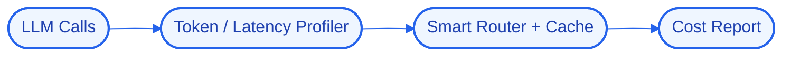

# Architecture — PulseForge

## High-Level Design (HLD)
PulseForge profiles every model call for tokens, latency, and cost, then routes and caches to cut spend — an observability-plus-optimization layer for an AI product’s model usage.

**Flow:** LLM Calls → Token / Latency Profiler → Smart Router + Cache → Cost Report

## Low-Level Design (LLD)
- **Components:** `OpenAI`, `Redis`, `Prometheus`
- **Interfaces / contracts:** to be finalized during implementation.
- **Data model:** to be defined per component.

## Decision Log
- **Why this stack:** **OpenAI** — cloud llm reasoning; **Redis** — in-memory store / cache / queue; **Prometheus** — metrics & alerting.
- **Antigravity constraint:** run logic/state/UI locally; offload heavy reasoning to cloud APIs; target modest hardware.

## Concept Deep Dive
Turning raw model telemetry into routing and caching decisions that measurably lower cost.
